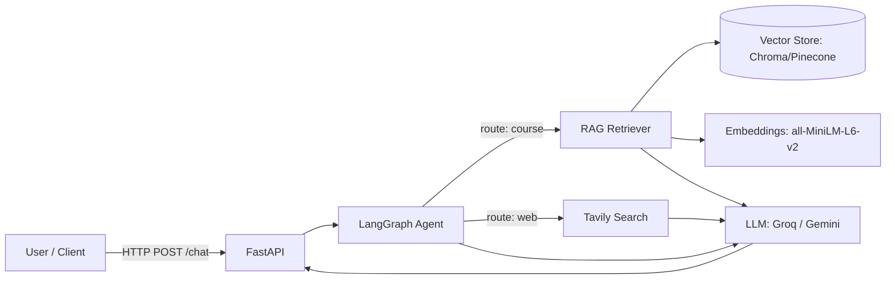

# IntelliCourse — AI‑Powered University Course Advisor

**Due:** 26 September 2025  
**Demo sessions:** 27–28 September 2025

IntelliCourse is a REST API‑powered assistant that answers student questions about courses using **Retrieval‑Augmented Generation (RAG)** and a **LangGraph agent** that routes between a **course catalog retriever** and **web search**.

---

## Quickstart

```bash
# 1) Create & activate a virtualenv (recommended)
python -m venv .venv && source .venv/bin/activate   # (Windows: .venv\Scripts\activate)

# 2) Install deps
pip install -r requirements.txt

# 3) Configure environment
cp .env.example .env
# Put your API keys in .env (Groq or Gemini, and Tavily)

# 4) Index your course catalog (PDFs in ./data/)
python scripts/index_catalog.py --data_dir data/sample --persist

# 5) Run the API
uvicorn app.api:app --reload --port 8000
```

**Ping the API:**

```bash
curl -s -X POST http://localhost:8000/chat -H "Content-Type: application/json"   -d '{"query":"What are the prerequisites for Advanced Machine Learning?"}' | jq
```

---

## Architecture



- **Router Node** decides whether the query is course‑related or general.  
- **Course Retrieval Node** fetches top‑K chunks from the vector DB.  
- **Web Search Node** pulls top results for broader questions.  
- **Generation Node** synthesizes a final answer with citations.

---

## Project Layout

```
intellicourse/
├── app/
│   ├── api.py               # FastAPI app (/chat endpoint)
│   ├── agent_graph.py       # LangGraph agent (router, retrieval, search, generation)
│   ├── config.py            # Env config + LLM/vector init
│   ├── prompts.py           # System & routing prompts
│   └── rag.py               # RAG indexing & retriever
├── scripts/
│   └── index_catalog.py     # CLI to index PDFs into vector store
├── tests/
│   └── test_api.py          # Minimal API test
├── data/
│   └── sample/              # Put course PDFs here (CS/Bio/Math)
├── .env.example
├── requirements.txt
└── README.md
```

---

## API

**Endpoint:** `POST /chat`

**Request:**

```json
{
  "query": "Give me a course that combines biology with computer science."
}
```

**Response:**

```json
{
  "answer": "...",
  "source_tool": "course_db",
  "retrieved_context": [
    { "source": "cs_department_2024.pdf", "page": 42, "snippet": "..." }
  ]
}
```

---

## Data Indexing

Put your course PDFs into `./data/<your_dept>/...`. Then run:

```bash
python scripts/index_catalog.py --data_dir data/sample --persist
```

This will:
- Load PDFs with `PyPDFLoader`
- Split text with `RecursiveCharacterTextSplitter`
- Embed with `all-MiniLM-L6-v2`
- Store vectors in Chroma (persisted in `.chroma/` by default)

To use Pinecone, set `VECTOR_STORE=pinecone` and provide `PINECONE_*` in `.env`.

---

## Presenting IntelliCourse

Use the included **deck outline** in `docs/deck_outline.md` (with speaker notes) during your demo.

---

## Evaluation Mapping

- **Functionality (60%)**: RAG retrieval, correct routing, API JSON outputs
- **Code Quality (35%)**: PEP‑8, logical modules, Pydantic models
- **Docs (5%)**: This README + setup + sample curl

---

## Security & Privacy

- Do **not** index documents containing PII.  
- Keep API keys in `.env` and never commit them.  
- The API returns only the minimum context snippets for transparency.

---

## Troubleshooting

- If imports fail, ensure you’re using recent versions in `requirements.txt`.
- If embeddings download is slow, pre‑download the HF model or set `HF_HOME` cache.
- For demo safety, pre‑index PDFs and avoid live model switches.

---

© 2025 IntelliCourse — MIT License
